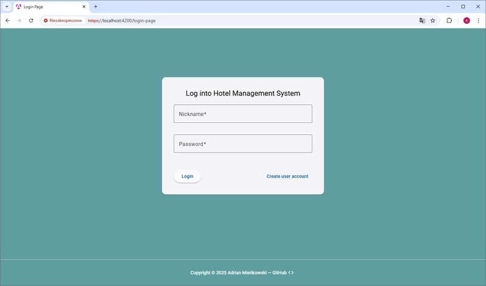
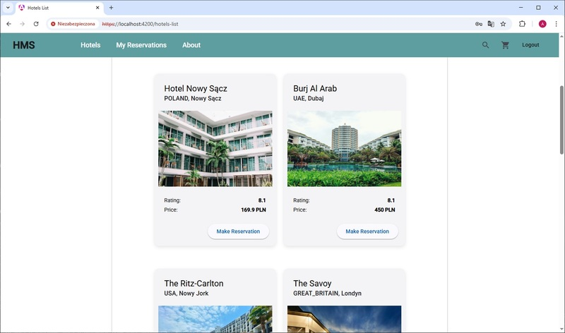
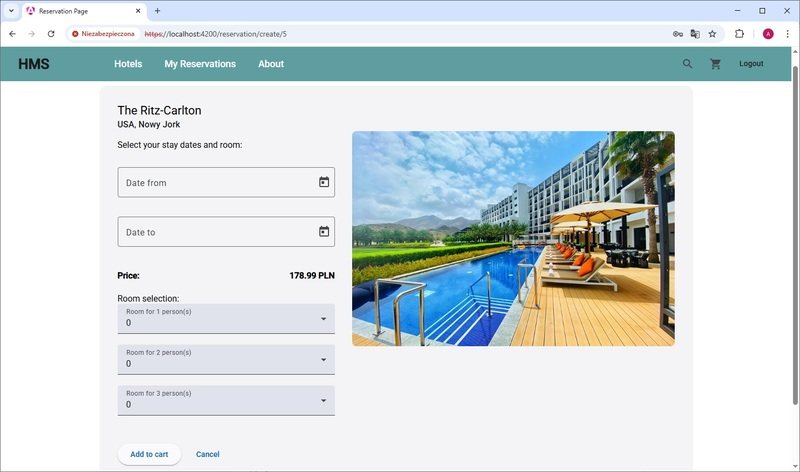

[Readme ENG](README.md)

# Hotel Booking App – Frontend

**Zobacz online:** [adrian-mienkowski-booking-app.vercel.app](https://adrian-mienkowski-booking-app.vercel.app)
- login: `demo`
- hasło: `demo123`

> ℹ️ Uwaga: Serwer backendu może potrzebować do 2 minut na „rozbudzenie się” po kilkunastu minutach bezczynności (ograniczenia darmowego hostingu). Proszę o cierpliwość przy pierwszym logowaniu.

Frontendowa część aplikacji do rezerwacji hoteli, zbudowana w Angularze z użyciem TypeScript. Obsługuje logowanie użytkownika, wyświetlanie listy hoteli oraz szczegółów wybranego hotelu. Aplikacja komunikuje się z backendem w Spring Boot poprzez REST API i wykorzystuje uwierzytelnianie oparte na JWT, przy czym access token jest przechowywany w localStorage, a refresh token w httpOnly cookie.

<p align="center">
  
</p>
<p align="center">
  
  
</p>

## Instalacja i uruchomienie

**Wymagania:**
- Node.js ≥ 18
- npm ≥ 9
- OpenSSL (do wygenerowania certyfikatów SSL)

Do prawidłowego działania logowania wymagane są:
- uruchomiony backend: [hms-backend](https://github.com/ArdianM90/hms-backend)
- wygenerowane pliki SSL (`key.pem`, `cert.pem`) w katalogu `./ssl`.

Pliki SSL można wygenerować poleceniem:
```bash
openssl req -x509 -newkey rsa:4096 -nodes -keyout ssl/key.pem -out ssl/cert.pem -days 365
```

**Budowanie i uruchamianie projektu:**
```bash
npm install
npm run build
npm start
```

Domyślnie aplikacja uruchamia się pod adresem: [https://localhost:4200](https://localhost:4200)

## Technologie
- [Angular](https://angular.io/)
- [TypeScript](https://www.typescriptlang.org/)
- [Angular Material (MUI)](https://material.angular.io/)
- [RxJS](https://rxjs.dev/)
- [Vercel](https://vercel.com/) – hosting
- Uwierzytelnianie z wykorzystaniem tokenów JWT (access token w local storage + refresh token w httpOnly cookie)

## REST API – dostępne endpointy
### Autentykacja (AuthenticationController.java)

| Metoda | Endpoint              | Opis                     | Autoryzacja                     |
|--------|-----------------------|--------------------------|---------------------------------|
| POST   | /hms/v1/auth/login    | Logowanie użytkownika    | nie                             |
| POST   | /hms/v1/auth/logout   | Wylogowanie użytkownika  | nie                             |
| POST   | /hms/v1/auth/refresh  | Odświeżenie tokena JWT   | refresh token w httpOnly cookie |

### Lista hoteli (HotelListController.java)

| Metoda | Endpoint           | Opis                         | Autoryzacja                 |
|--------|--------------------|------------------------------|-----------------------------|
| GET    | /hms/v1/hotel/{id} | Szczegóły konkretnego hotelu | access token/ refresh token |
| GET    | /hms/v1/hotels     | Pobranie listy hoteli        | access token/ refresh token |

### Planowane następne kroki rozwoju aplikacji:
- rejestracja nowych użytkowników,
- możliwość składania rezerwacji przez użytkowników.
